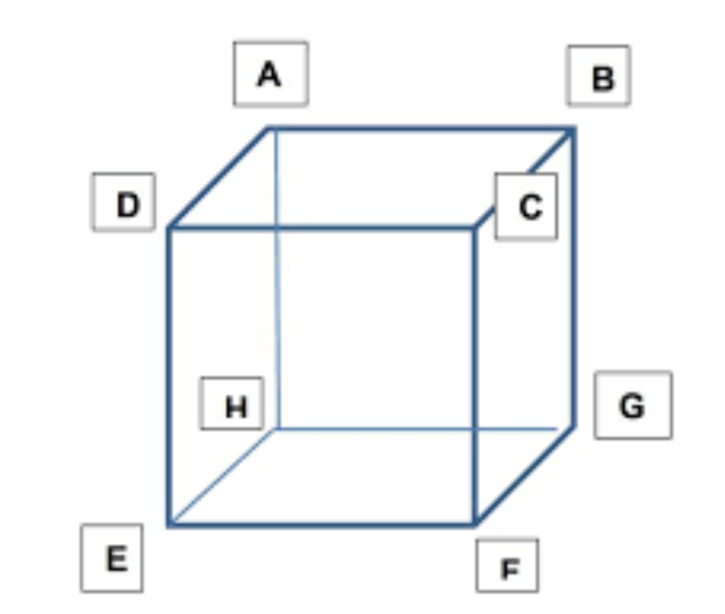

# Simulacion-de-Movimiento-3D---Python
Este programa hace una simple simulación del movimiento que se puede programar en Python usando librerías comunes

En este repositorio existen dos códigos. Ambos códigos hacen la misma simulación. 

### Code_traditional.py

Este código está escrito de forma tradicional casi por completo.

Primero importamos las librerías necesarias para la animación.

```
import numpy as np
import seaborn as sbn
impor time
import matplotlib.pyplot as plt
```

Primero colocamos las medidas de los lados del prisma y luego colocamos las coordenadas que formarán el prisma. Recordando que un prisma se compone de **aristas (unión entre vértices)** y **vértices (esquinas)** y que para formar un cubo es necesario tener 8 vértices para formar 6 caras, como se muestra en la siguiente firuga: 



Escribimos el vector **Ones** que sirve para hacer la matriz de transformaciones la cual será definida a continuación. 

Escribimos la función del movimiento que en este caso será: 

```
x = np.arange(0, 2*np.pi, 0.1)
y = np.sin(x)*2
```

La figura a continuación es la representación gráfica de la función que describe el movimiento. 

**COLOCAR LA IMAGEN DE LA FUNCION**

Posteriormente comenzamos con la creación de la figura principal usando el comando necesario para hacer una proyección en 3D con el comando: 

```
plt.axes = plt.axes(projection = '3d')
```

Definimos un parámetro llamado **pause** que será parte de la animación. 


### Animaciones / Animations. 

Las animaciones estás basadas en solamente iteraciones **for**, en donde el contenido es el mismo, todo esto desde una programación tradicional en donde la simulación del movimiento del cubo. 

La función **for** se repetirá el tamaño de la **y** veces. 
Comenzamos por iterar el valor en la posición de la función **y**. Luego colocamos la matriz de traslación en X y le colocamos el valor que nos da la iteración, como se muestra a continuación: 

```
[
[1, 0, 0, j], 
[0, 1, 0, 0], 
[0, 0, 1, 0], 
[0, 0, 0 ,1]
]
```

Luego hacemos un producto punto _( np.dot() )_ con la matriz anterior y la matriz principal que contiene los puntos del cubo.

Finalmente, mostramos uno a uno los frames generados en ese momento.

La lìnea:

```
plot_axes.scatter([-5, 5], [-5, 5], [-5, 5], c="w") #Fijamos límites
```

Es una forma ingeniosa para tener una ejes fijos. La idea es colocar puntos _(scatter)_ en unos extremos y dejarlos fijos, con la finalidad de dejar un espacio fijo. 

La lìnea: 

```
plt.pause(pauseV)
```

Sirve para hacer una pausa en la simulaciòn, con la finalidad de que nuestro equipo pueda mostrar los frames uno a uno. 


**Generalidades**

El còdigo està compuesto mayormente por ciclos **for** que cuntienen al inicio del ciclo la evaluaciòn individual de la funciòn **seno()** para observar el movimiento.


